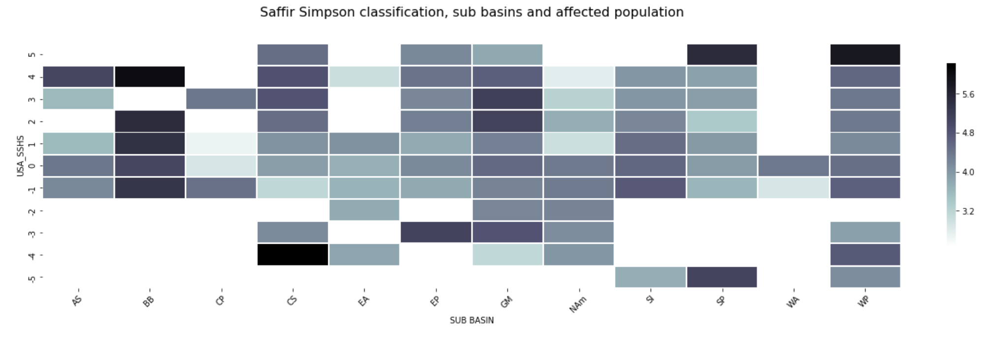
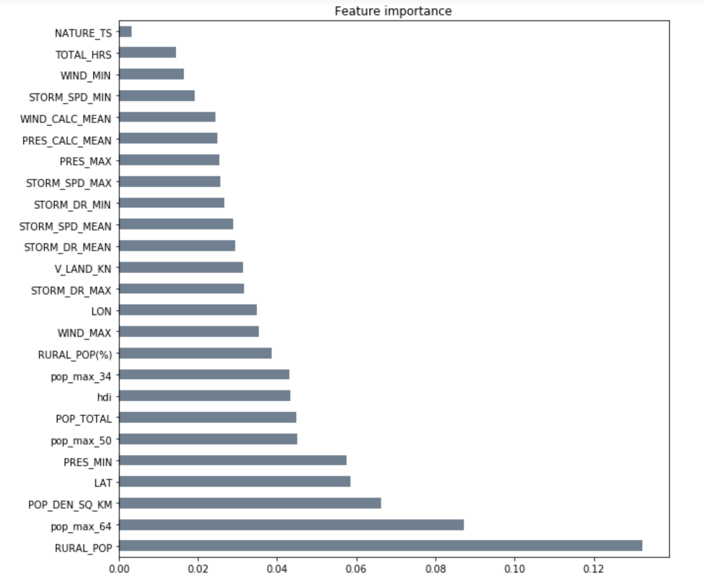
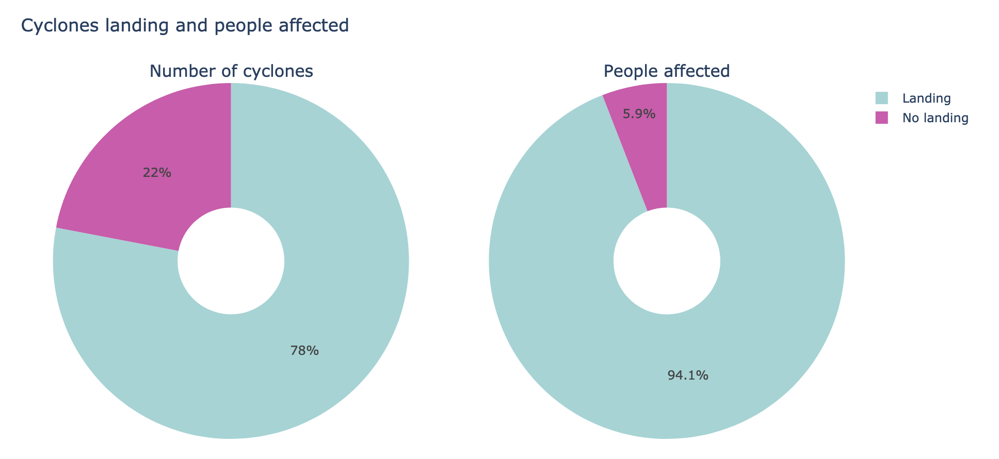

# Helper file for Random Forest Regressor

1. Xavier did some Random Forest initial setting considering the available version of the data set.

2. Bego added a pipeline construction to validate our models more quickly in the future.

3. Fabi added a primer feature selection and modeling considering a new variable: Human Development Index (HDI). Also, in the notebook FeaturePrimer-RandomForest.ipynb we derived some conclusions involving categorical variables suggesting changes to the original dataset.

After dropping the feature ``TOTAL_DEATHS`` from our data, and considering also the HDI data, we can see below the variables than have more importance in our primer model:

4. Joseph designed a random forest utilizing minmax scaler, standard scaler and PCA to improve performance. However, algorithm still needs improvement.

5. Fabi added improved versions of model_validator and model_validator_log functions. Also there are more insights regarding the importance of the features regarding landing of cyclones. New plot created with plotly is added. 

6. There are new insights: Due tho the high presence of outliers in the target variable, no hyperparameter tunning would be helpful. This is a problem wth the nature of data itself. Maybe next step could be getting ride of outliers using HQR or applying this model to different clusters.

